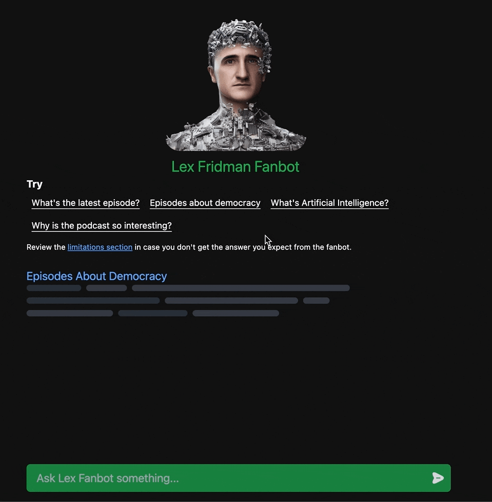

  

### The Lex Fanbot

The Lex Fanbot is a chat assistant created to respond questions about The Lex Fridman Podcast.
It searches through data about the episodes and their captions to produce a semantic search.
You can try it [here](https://lexfanbot.netlify.app/) and chek the [about page](https://lexfanbot.netlify.app/about.html) for more information.

#### Quick Demo

